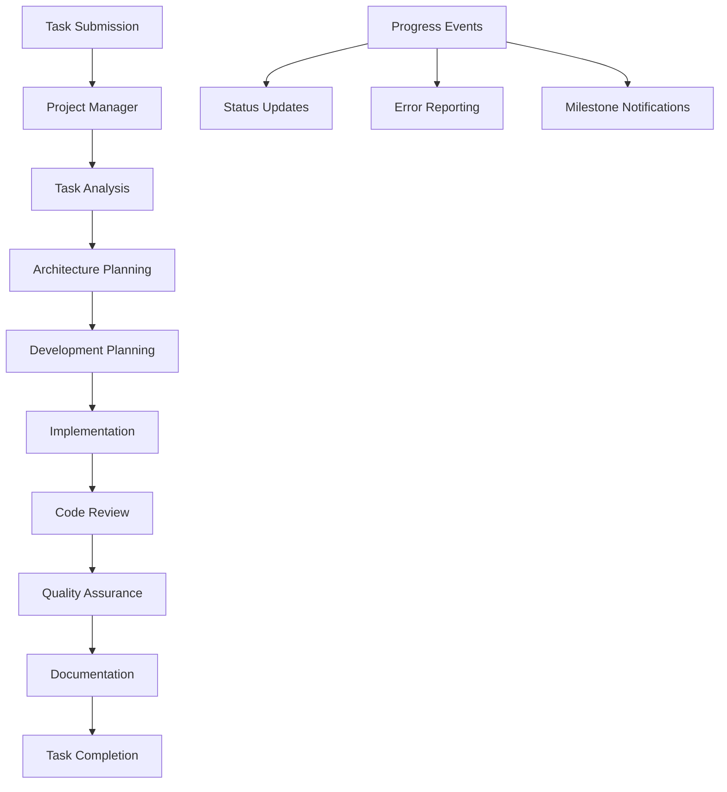

# DevTeam Manager

## Overview

The DevTeam Manager is a sophisticated management system that utilizes LangGraph to orchestrate a series of AI agents working together as a complete software development team. This manager exposes object-oriented systems to tools, allowing them to submit development tasks and receive progress updates through the event bus.

## Architecture

### Core Components

#### 1. Manager Infrastructure
- **Base Class**: Extends `BaseManager` for lifecycle management and event integration
- **Threading**: Runs in its own thread as per manager framework design
- **Communication**: Uses the Pythonium event bus for all external communication
- **Health Monitoring**: Includes built-in health checks and metrics

#### 2. Agent Framework
- **Orchestration**: LangGraph-based workflow management
- **Agent Types**: Specialized agents for different development roles
- **Task Distribution**: Intelligent task routing and assignment
- **Collaboration**: Inter-agent communication and dependency management

#### 3. Event-Driven Interface
- **Task Submission**: Tools submit tasks via event bus
- **Progress Updates**: Real-time progress notifications
- **Status Reporting**: Detailed status and error reporting
- **Result Delivery**: Completed work delivered via events

## Agent Architecture

### Agent Roles

#### 1. **Project Manager Agent**
- **Responsibilities**: 
  - Task decomposition and planning
  - Resource allocation and timeline management
  - Progress tracking and reporting
  - Risk assessment and mitigation
- **Capabilities**:
  - Break down complex tasks into manageable units
  - Estimate effort and dependencies
  - Monitor team progress and blockers
  - Generate status reports

#### 2. **Software Architect Agent**
- **Responsibilities**:
  - System design and architecture planning
  - Technology stack recommendations
  - Integration and dependency analysis
  - Design pattern implementation
- **Capabilities**:
  - Analyze requirements and create architectural designs
  - Recommend appropriate technologies and frameworks
  - Design system interfaces and APIs
  - Create technical specifications

#### 3. **Developer Agent**
- **Responsibilities**:
  - Code implementation and development
  - Bug fixing and feature implementation
  - Code optimization and refactoring
  - Technical problem solving
- **Capabilities**:
  - Write code in multiple programming languages
  - Implement features based on specifications
  - Debug and fix issues
  - Optimize performance and maintainability

#### 4. **Code Reviewer Agent**
- **Responsibilities**:
  - Code quality assurance
  - Security vulnerability detection
  - Best practices enforcement
  - Performance review
- **Capabilities**:
  - Analyze code for quality issues
  - Check for security vulnerabilities
  - Ensure coding standards compliance
  - Review performance implications

#### 5. **Quality Assurance Agent**
- **Responsibilities**:
  - Test planning and strategy
  - Test case creation and execution
  - Bug detection and reporting
  - Quality metrics tracking
- **Capabilities**:
  - Design comprehensive test suites
  - Execute automated and manual tests
  - Report and track defects
  - Validate requirements compliance

#### 6. **Documentation Agent**
- **Responsibilities**:
  - Technical documentation creation
  - API documentation generation
  - User guide development
  - Knowledge management
- **Capabilities**:
  - Generate comprehensive documentation
  - Create user-friendly guides
  - Maintain knowledge repositories
  - Ensure documentation accuracy

### Agent Workflow



## Event System Integration

### Event Categories

#### 1. **Task Management Events**
- `devteam.task.submitted` - New task received
- `devteam.task.started` - Task processing began
- `devteam.task.completed` - Task finished successfully
- `devteam.task.failed` - Task failed with errors
- `devteam.task.cancelled` - Task was cancelled

#### 2. **Progress Events**
- `devteam.progress.milestone` - Major milestone reached
- `devteam.progress.phase_change` - Moving to new development phase
- `devteam.progress.agent_update` - Individual agent progress update
- `devteam.progress.blocking_issue` - Task blocked by dependencies

#### 3. **Agent Events**
- `devteam.agent.assigned` - Agent assigned to task
- `devteam.agent.started` - Agent began work
- `devteam.agent.completed` - Agent finished work
- `devteam.agent.error` - Agent encountered error

#### 4. **Collaboration Events**
- `devteam.collaboration.handoff` - Work handed off between agents
- `devteam.collaboration.review_request` - Review requested
- `devteam.collaboration.feedback` - Feedback provided
- `devteam.collaboration.dependency` - Dependency notification

### Event Schemas

#### Task Submission Event
```python
@dataclass
class TaskSubmissionEvent:
    task_id: str
    task_type: str  # "feature", "bugfix", "refactor", "analysis"
    description: str
    requirements: List[str]
    constraints: Dict[str, Any]
    priority: int  # 1-5, 5 being highest
    deadline: Optional[datetime]
    submitter: str
    context: Dict[str, Any]
```

#### Progress Update Event
```python
@dataclass
class ProgressUpdateEvent:
    task_id: str
    phase: str
    percentage_complete: float
    current_agent: str
    estimated_completion: Optional[datetime]
    blockers: List[str]
    recent_accomplishments: List[str]
    next_steps: List[str]
```

## Configuration

### Manager Configuration
```yaml
managers:
  devteam:
    enabled: true
    max_concurrent_tasks: 5
    default_timeout_hours: 24
    agent_timeout_minutes: 30
    
    # LangGraph Configuration
    langgraph:
      model_provider: "openai"  # "openai", "anthropic", "azure"
      model_name: "gpt-4"
      temperature: 0.7
      max_tokens: 4000
      
    # Agent Configuration
    agents:
      project_manager:
        enabled: true
        max_tasks: 10
      architect:
        enabled: true
        max_tasks: 3
      developer:
        enabled: true
        instances: 2  # Multiple developer agents
        max_tasks: 5
      reviewer:
        enabled: true
        max_tasks: 8
      qa:
        enabled: true
        max_tasks: 5
      documentation:
        enabled: true
        max_tasks: 3
        
    # Workflow Configuration
    workflow:
      require_architecture_review: true
      require_code_review: true
      require_testing: true
      require_documentation: true
      parallel_development: true
      
    # Quality Gates
    quality_gates:
      code_coverage_threshold: 80
      complexity_threshold: 10
      security_scan_required: true
      performance_test_required: false
```

## Implementation Plan

### Phase 1: Foundation (Week 1)
- [x] Create comprehensive documentation
- [ ] Add langgraph dependency to requirements
- [ ] Implement basic DevTeam manager class
- [ ] Set up event schemas and handlers
- [ ] Create agent base classes

### Phase 2: Core Agents (Week 2)
- [ ] Implement Project Manager agent
- [ ] Implement Developer agent  
- [ ] Create basic task workflow
- [ ] Add progress reporting
- [ ] Implement error handling

### Phase 3: Extended Team (Week 3)
- [ ] Implement Code Reviewer agent
- [ ] Implement QA agent
- [ ] Implement Documentation agent
- [ ] Add agent collaboration features
- [ ] Implement quality gates

### Phase 4: Advanced Features (Week 4)
- [ ] Add Architect agent
- [ ] Implement parallel task processing
- [ ] Add performance monitoring
- [ ] Create comprehensive testing
- [ ] Add configuration management

### Phase 5: Integration & Polish (Week 5)
- [ ] Tool integration examples
- [ ] Performance optimization
- [ ] Security hardening
- [ ] Documentation completion
- [ ] Production readiness

## Usage Examples

### Basic Task Submission
```python
# Tool submitting a development task
await event_manager.publish("devteam.task.submit", {
    "task_id": "feature-123",
    "task_type": "feature",
    "description": "Implement user authentication system",
    "requirements": [
        "JWT token-based authentication",
        "Password reset functionality",
        "Multi-factor authentication support"
    ],
    "priority": 4,
    "submitter": "api_tool"
})
```

### Progress Monitoring
```python
# Tool subscribing to progress updates
def handle_progress(event):
    data = event.data
    print(f"Task {data['task_id']}: {data['percentage_complete']}% complete")
    print(f"Current phase: {data['phase']}")
    print(f"Current agent: {data['current_agent']}")

event_manager.subscribe("devteam.progress.*", handle_progress)
```

### Task Completion Handling
```python
# Tool handling task completion
def handle_completion(event):
    data = event.data
    task_id = data['task_id']
    results = data['results']
    
    print(f"Task {task_id} completed successfully!")
    print(f"Deliverables: {results['deliverables']}")
    print(f"Documentation: {results['documentation_urls']}")

event_manager.subscribe("devteam.task.completed", handle_completion)
```

## Quality Assurance

### Testing Strategy
- **Unit Tests**: Individual agent functionality
- **Integration Tests**: Agent collaboration workflows
- **End-to-End Tests**: Complete task processing
- **Performance Tests**: Concurrent task handling
- **Load Tests**: System capacity and limits

### Monitoring & Metrics
- **Task Metrics**: Completion rate, average time, success rate
- **Agent Metrics**: Utilization, performance, error rate
- **System Metrics**: Memory usage, CPU utilization, response time
- **Quality Metrics**: Code coverage, review findings, bug rates

### Error Handling
- **Graceful Degradation**: System continues with reduced functionality
- **Automatic Recovery**: Self-healing capabilities for common issues
- **Error Reporting**: Detailed error information via events
- **Rollback Mechanisms**: Ability to undo partial work

## Security Considerations

### Access Control
- **Authentication**: Verify task submitter identity
- **Authorization**: Ensure submitter has permission for task type
- **Rate Limiting**: Prevent abuse and resource exhaustion
- **Audit Logging**: Track all operations for security review

### Data Protection
- **Input Validation**: Sanitize all task inputs
- **Output Filtering**: Remove sensitive information from results
- **Secure Communication**: Encrypted event bus communication
- **Data Retention**: Configurable data retention policies

## Future Enhancements

### Advanced Capabilities
- **Machine Learning**: Learn from past tasks to improve performance
- **Resource Optimization**: Dynamic agent scaling based on workload
- **Integration APIs**: Direct API access for external systems
- **Workflow Customization**: User-defined development workflows

### Extended Agent Types
- **DevOps Agent**: Deployment and infrastructure management
- **Security Agent**: Security testing and vulnerability assessment
- **Performance Agent**: Performance optimization and monitoring
- **UX Agent**: User experience and interface design

### Enterprise Features
- **Multi-tenant Support**: Isolated environments for different teams
- **Advanced Analytics**: Detailed reporting and insights
- **Compliance Monitoring**: Regulatory compliance checking
- **Integration Hub**: Pre-built integrations with popular tools

---

This document serves as the comprehensive design specification for the DevTeam Manager. It will be updated throughout the implementation process to reflect actual implementation details and lessons learned.